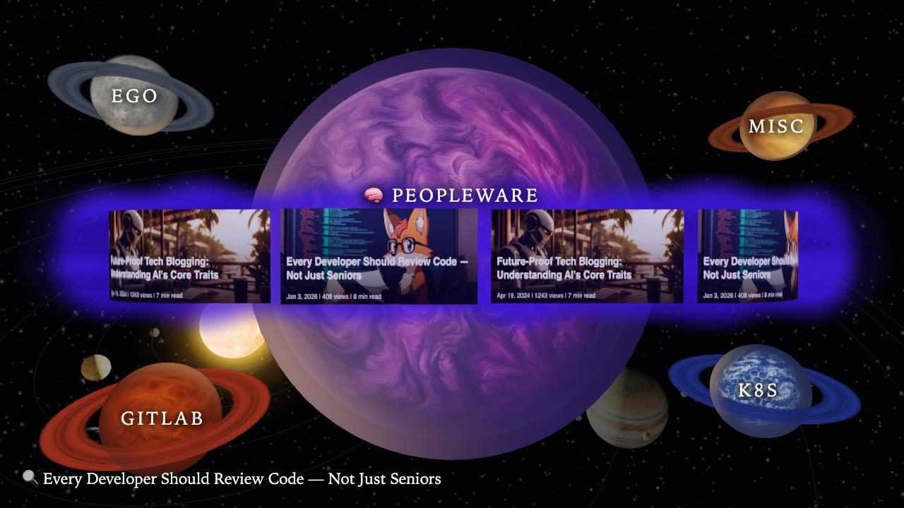
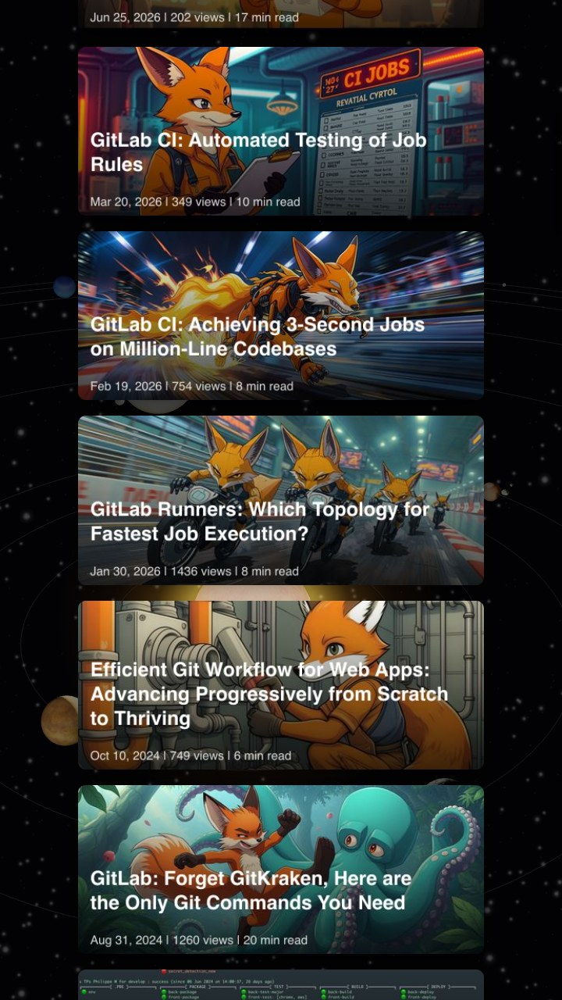

# planets

Three.js atlas of [my articles](https://dev.to/bcouetil/all-my-articles-by-theme-463k): five series as planets.

Live: <https://bcouetil.github.io/planets/>

The live page picks desktop or mobile from the device. Both layouts are below so you can see them from any screen.

**Desktop** — move across the belt to scroll covers, hover a docked planet to switch series, click a badge to open the article.



**Mobile** — swipe the stacked covers, tap one to open. Section titles sit at mid-screen at the start of the list.



```bash
python3 -m http.server 8765 --bind 127.0.0.1
```

Then open <http://127.0.0.1:8765/>. Append `?mobile=1` to force the phone layout. Not `file://` (CORS on badge textures).

Three.js 0.170 via import map. Background solar system adapted from [N3rson/Solar-System-3D](https://github.com/N3rson/Solar-System-3D) (MIT, Karol Fryc); texture credits in `solar/NOTICE.txt`.
